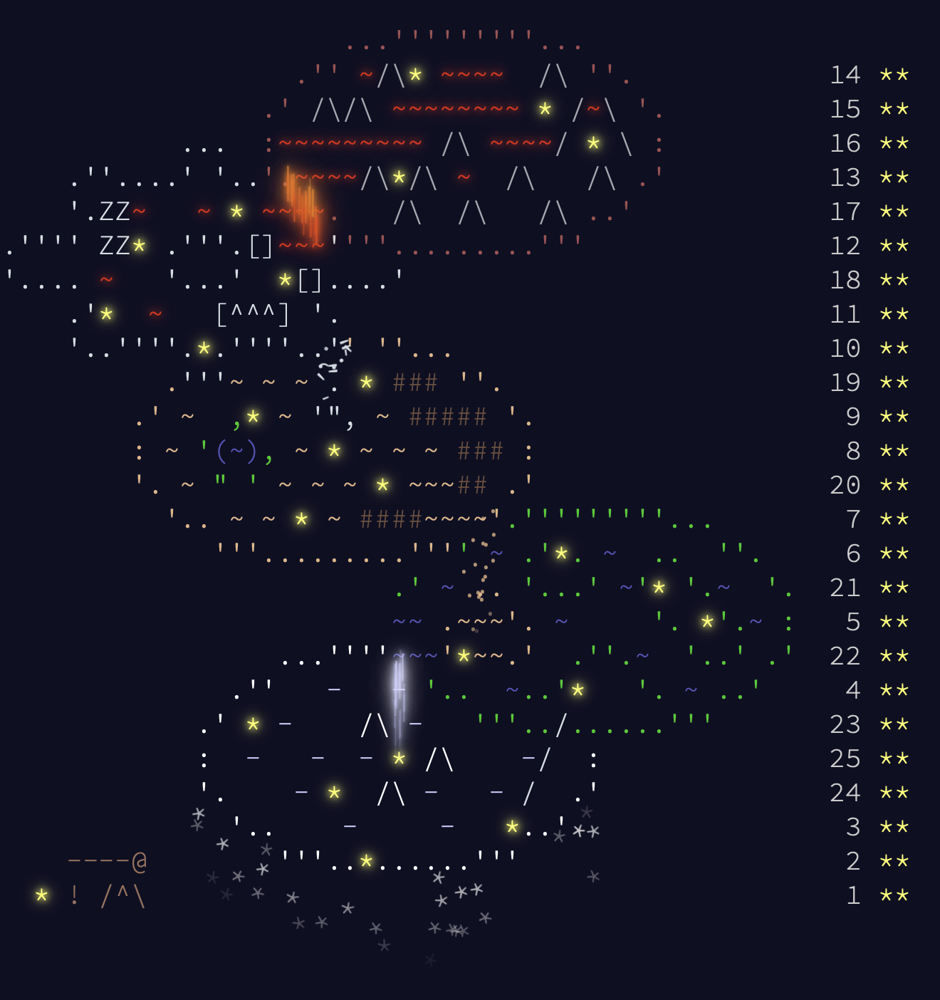

# AOC 2023
Solutions on the yearly advent of code challenges, written in Python 

## Visualization
### Day 10
Part 1 Visualization (Matplotlib)

### Day 14
Part 2 Visualization (Unicode in Terminal)

### Day 16
Part 1 Visualization (Unicode in Terminal)

### Day 25

## DSA topics worth revisiting
- day 5: Array slicing
- day 8: LCM problem
- day 9: Recursion
- day 12: Dynamic programming - recursive/memoization (text slicing)
- day 15: Hash table / hashmap
- day 17: priority queue, heapq (shortest path problem)
- day 18: polygon area (shoelace formula / pick's theorem)
- day 20: deque (instead of recursive), LCM problem
- day 21: step counter (part 2 analysis)
    - Principle mentioned: Manhattan distance
- day 22: Python Sets operation (https://realpython.com/python-sets)
- day 23: 
    - Part1 (own solution): max-heap
    - Part2 (online solution): Graph theory (adjacency list), depth-first search algorithm, using python stack
- day 24:
    - SymPy python package for symbolic mathematics (see equation derivation at https://www.youtube.com/watch?v=guOyA7Ijqgk)
- day 25:
    - graph theory, networkx python package

